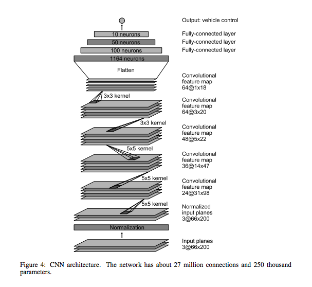
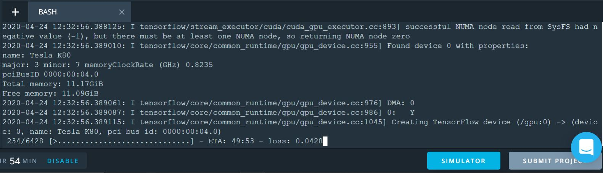
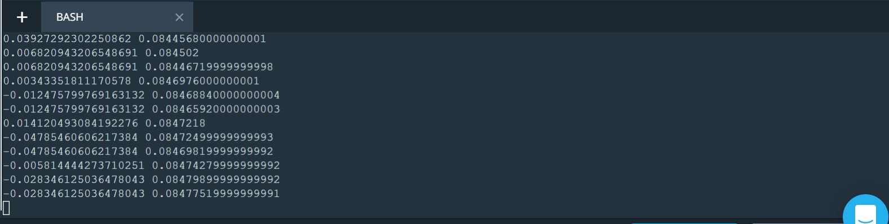
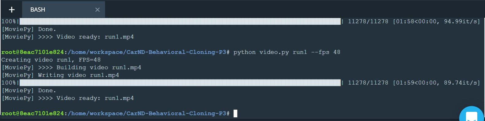

# Behavioral Cloning Project

[](http://www.udacity.com/drive)

## Overview
---
The goal of the project was to train a Deep Network to replicate the human steering behavior while driving, thus being able to drive autonomously on a simulator provided by Udacity. To this purpose, the network takes as input the frame of the frontal camera and predicts the steering direction at each instant.

In this project, let's use what we've learned about deep neural networks and convolutional neural networks to clone driving behavior. We will train, validate and test a model using Keras. The model will output a steering angle to an autonomous vehicle.

Udacity has provided a simulator (or download the simulator if you're working on your project on your local machine) where we can steer a car around a track for data collection. We will use image data and steering angles to train a neural network and then use this model to drive the car autonomously around the track.

## Project Goal(s)

- Use the simulator to collect data of good driving behavior
- Build, a convolution neural network in Keras that predicts steering angles from images
- Train and validate the model with a training and validation set
- Test that the model successfully drives around track one without leaving the road
- Summarize the results with a written report

## Directory & File Structure

The project has the following five major files: 
* model.py (script used to create and train the model)
* drive.py (script to drive the car - feel free to modify this file)
* model.h5 (a trained Keras model)
* a report writeup file (either markdown or pdf)
* video.mp4 (a video recording of your vehicle driving autonomously around the track for at least one full lap)
Additional helper function files in this project include:
* data_Augment.py
* datapipe.py
All the results (screenshots, videos, image log) can be found in the following folders:
* run1
* results


## Dependencies and Libraries
- Python
- Matplotlib
- Numpy
- Keras
- Tensorflow
- Sklearn

This README file describes how to output the video in the "Details About Files In This Directory" section.

## Model Architecture
I have implemented the model using [NVIDIA's End to End Learning for Self-Driving Cars](https://images.nvidia.com/content/tegra/automotive/images/2016/solutions/pdf/end-to-end-dl-using-px.pdf) which was developed to achieve similar behavior cloning objective. As this is a typical image classification problem a convolutional neural was choosen in order to maintain the spatial structure of the images, and the relationships between adjacent pixels. Convolutional neural networks avoid the problem of having to flatten the images into a 1 dimensional vector and are therefore more powerful in recognizing n-dimensional images. So, the model is inspired by this Nvidia model where they trained a convolutional neural network for a similar type of problem.

The model is a convolution neural network that accepts a 160x320 (the original model takes in 66x200) pixel-wide image with 3 channels and outputs one node, which can be the steering angle of the vehicle. This CNN consisted of a normalization layer and 5 convolution layers followed by 4 fully connected layers.



I used 'elu' activation function to introduce nonlinearity, and the data is normalized in the model using a Keras lambda layer. Dropout layers are also included to prevent overfitting as this model is trained only using the Track 1 data.

## Dataset
Training data was chosen to keep the vehicle driving on the road. I used the Udacity sample dataset which is a combination of center lane driving, and recovery driving (i.e. recovering the car to the center of the road when it is off to the edges).

## Data Collection Strategy
Data for this task can be gathered with the Udacity simulator in the 'Training Mode'. The car is controlled by the human through the keyboard, and steering directions and image data is collected through three forward facing cameras mounted on the vehicle.

For training the model two different types of driving, Controlled Driving and Recovery Driving were carried out.

Controlled driving: The aim was to maintain the vehicle close to the center of the driving lane as it travelled through the simulator course. The following picture shows the distribution of the steering angle in the dataset. It is obvious that a significant portion of the data is just driving on a straight road with steering angles around 0°. This is not sufficient for successfully train a neural network, which should be able to recover back to the center once it has driven the car to the shoulder. The second item is that the data is biased to minus steering angles as the track is mostly bending to the left. This makes it difficult for the neural network to successfully manage right hand bends. Therefore an additional round but clockwise was collected additionally.

Recovery driving: Here special manoeuvre are driven e.g. segments which started from the outside of the lane (on either side) and recorded the vehicle driving back towards the center of the lane. Inevitably there will be times when the car drifts beyond the images recorded from the side cameras in controlled driving and it must make a larger steering correction back towards center. The recovery images trained the car to make this correction when it finds itself drifting towards the curb/lane lines on either side of the road.

The resulting data set consists of the following driving manoeuvre:

- 1 lap, centered driving, counter-clockwise direction
- 1 lap, centered driving, clock-wise direction
- Additional maneuver for recovering to center
- Additional maneuver for driving smooth in curves
- Additional maneuver for critical waypoints

Data Preprocessing, Data Augmentation, Shear Transformations, etc. are all to be included in the jupyter notebook (.ipynb file) of this project soon. 
(NOTE: I couldn't do the image preprocessing as I wasn't able to use jupyter notebook on the workspace provided. Moreover, using 'ipython' in command prompt was a hassle and I couldn't produce most of the results in a presentable manner).
I'd rather work my way around, spend some time and produce the results in a presentable format than adding what I have (as of now) to this project repo.

## Training Strategy
1. Training Pipeline
For training purpose, I use AWS's g2.x2large instance with attached GPU.

Since the dataset is huge, it makes sense to utilize python's generator pattern to feed the batch of images, after preprocessing, to the model to avoiding preloading the entire dataset into a machine's memory.

Keras' fit_generator API is perfect with of combination of using generator.

The dataset is split 20% as validation set while the rest is used as training set.

I have created two generators for the training set and validation set. The batch size is 128.
`train_gen = g.sample_generator(train_samples, DATA_PATH, batch_size=BATCH_SIZE)`
`validation_gen = g.sample_generator(validation_samples, DATA_PATH, batch_size=BATCH_SIZE, augment_enable=False)`
I used 'Adam' optimizer with learning rate as 1e-3 and train for 1 epoch(s) with the number of images equal to that in the dataset per epoch.

2. Hyperparameter Tuning
During the entire training process, overfitting is not an issue. The validation error is well under training error, such that model seems rather to be underfitting. This is resolved by extending the number of epoch to train for. Data augmentation certainty helps to prevent overfitting.

3. Training Process
At first, the cropping process is a layer within the model and is not a separate preprocessing step. For this reason the model is accepting the full image (320x160) as input. The model trained with Udacity's dataset is doing reasonable across different sections of the track. 




## Dependencies
This lab requires:

* [CarND Term1 Starter Kit](https://github.com/udacity/CarND-Term1-Starter-Kit)

The lab enviroment can be created with CarND Term1 Starter Kit. Click [here](https://github.com/udacity/CarND-Term1-Starter-Kit/blob/master/README.md) for the details.

The following resources can be found in this github repository:
* drive.py
* video.py
* writeup_template.md

The simulator can be downloaded from the classroom. In the classroom, Udacity has also provided sample data that we can optionally use to help train your model.

## Compiling and Details About Files In This Directory

### `drive.py`

Usage of `drive.py` requires you have saved the trained model as an h5 file, i.e. `model.h5`. See the [Keras documentation](https://keras.io/getting-started/faq/#how-can-i-save-a-keras-model) for how to create this file using the following command:
```sh
model.save(filepath)
```

Once the model has been saved, it can be used with drive.py using this command:

```sh
python drive.py model.h5
```

The above command will load the trained model and use the model to make predictions on individual images in real-time and send the predicted angle back to the server via a websocket connection.

Note: There is known local system's setting issue with replacing "," with "." when using drive.py. When this happens it can make predicted steering values clipped to max/min values. If this occurs, a known fix for this is to add "export LANG=en_US.utf8" to the bashrc file.

#### Saving a video of the autonomous agent

```sh
python drive.py model.h5 run1
```
All the image files being added to the run1 folder:


The fourth argument, `run1`, is the directory in which to save the images seen by the agent. If the directory already exists, it'll be overwritten.

```sh
ls run1

[2017-01-09 16:10:23 EST]  12KiB 2017_01_09_21_10_23_424.jpg
[2017-01-09 16:10:23 EST]  12KiB 2017_01_09_21_10_23_451.jpg
[2017-01-09 16:10:23 EST]  12KiB 2017_01_09_21_10_23_477.jpg
[2017-01-09 16:10:23 EST]  12KiB 2017_01_09_21_10_23_528.jpg
[2017-01-09 16:10:23 EST]  12KiB 2017_01_09_21_10_23_573.jpg
[2017-01-09 16:10:23 EST]  12KiB 2017_01_09_21_10_23_618.jpg
[2017-01-09 16:10:23 EST]  12KiB 2017_01_09_21_10_23_697.jpg
[2017-01-09 16:10:23 EST]  12KiB 2017_01_09_21_10_23_723.jpg
[2017-01-09 16:10:23 EST]  12KiB 2017_01_09_21_10_23_749.jpg
[2017-01-09 16:10:23 EST]  12KiB 2017_01_09_21_10_23_817.jpg
...
```

The image file name is a timestamp of when the image was seen. This information is used by `video.py` to create a chronological video of the agent driving.

### `video.py`

```sh
python video.py run1
```


Creates a video based on images found in the `run1` directory. The name of the video will be the name of the directory followed by `'.mp4'`, so, in this case the video will be `run1.mp4`.

Optionally, one can specify the FPS (frames per second) of the video:

```sh
python video.py run1 --fps 48
```


Will run the video at 48 FPS. The default FPS is 60.

#### Why create a video

1. It's been noted the simulator might perform differently based on the hardware. So if your model drives succesfully on your machine it might not on another machine (your reviewer). Saving a video is a solid backup in case this happens.
2. You could slightly alter the code in `drive.py` and/or `video.py` to create a video of what your model sees after the image is processed (may be helpful for debugging).

### Tips
- Please keep in mind that training images are loaded in BGR colorspace using cv2 while drive.py load images in RGB to predict the steering angles.


## Results

The trained model performing in the 'Autonomous mode' is as shown in the video under the results folder:
  

The cropped and normalized version of the output video (.mp4) in 'Autonomous mode' is as shown below:


All the necessary log files of the trained images while driving the  car in the 'Training mode' can be found under the folder 'run1'
