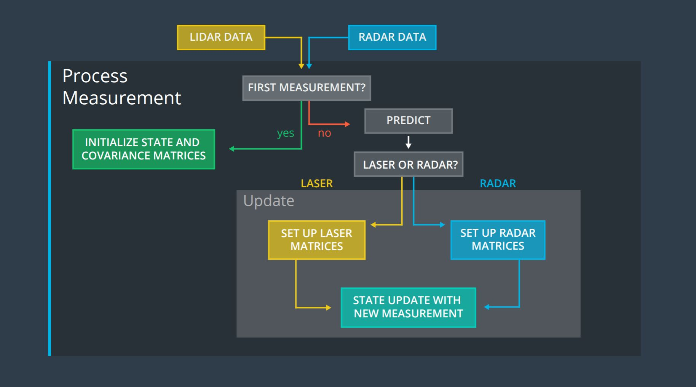
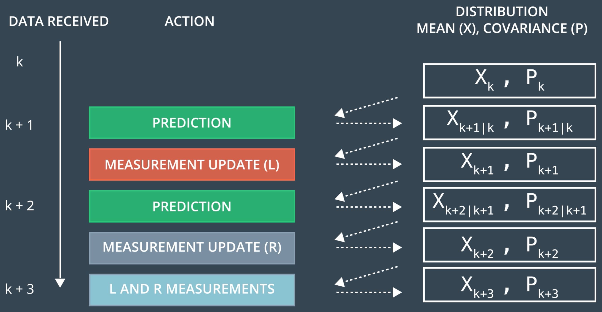

# Extended Kalman Filter Project
Self-Driving Car Engineer Nanodegree Program

## Overview

In this project you will utilize a kalman filter to estimate the state of a moving object of interest with noisy lidar and radar measurements. Passing the project requires obtaining RMSE values that are lower than the tolerance outlined in the project rubric. 

Kalman Filter is a mathematical approach of determining the state of the system. It calculates the system's state using a mathematical model of the motion and clarifies the state using the measurement information. For an introduction to Extended Kalman Filters (EKFs), see [here](https://en.wikipedia.org/wiki/Extended_Kalman_filter). 
  
Sensor fusion - is a process of combining measurements from different sensors to get one accurate picture. Sensor Fusion for object tracking using RADAR and LIDAR sensors is an actual task for the self-driving car. 


Image: Udacity Self-Driving Car Nanodegree  


## Basic Build Instructions

If you have already installed all the necessary dependencies for the projects in term 2 you should be good to go! If not, you should install them to get started on this project: [Getting Started for Term 2](../term2_How_to_get_started). 

1. Clone this repo.
2. Make a build directory: `mkdir build && cd build`
3. Compile: `cmake .. && make`
   * On Windows, you may need to run: `cmake .. -G "Unix Makefiles" && make`
4. Run it: `./ExtendedKF`

Once you launched the executable, simply run the simulator app and select the EKF/UKF simulation.

## Goal of this project

In this project we implement the Extended Kalman Filter (EKF) using the **constant velocity** model (CV) in C++ to combine data from RADAR and LIDAR. Noisy LIDAR and RADAR measurements detecting a bicycle that travels around your vehicle are provided. Using the Kalman filter and the measurements you are able to track the bicycle's **position** and **velocity**. 

## General Process

There are three main steps for programming a Kalman filter:

* **initializing** Kalman filter variables
* **predicting** where our object is going to be after a time step Δt
* **updating** where our object is based on sensor measurements

Then the prediction and update steps repeat themselves in a loop.



To measure how well the Kalman filter performs, the root mean squared error comparing the Kalman filter results with the provided ground truth will  be calculated afterwards. The simulator provides the ground truth state of the object to be tracked and displays the calculated root mean squared error (RMSE).

## File structure

Files in the Github src Folder:
1. main.cpp: 
  * communicates with the Term 2 Simulator receiving data measurements
  * calls a function to run the Kalman filter
  * calls a function to calculate RMSE
2. FusionEKF.cpp:
  * initializes variables and matrices (x, F, H_laser, H_jacobian, P, etc.) 
  * initializes the Kalman filter position vector with the first sensor measurements
  * modifies the F and Q matrices prior to the prediction step based on the elapsed time between measurements
  * calls the predict function
  * calls the update step for either the lidar or radar sensor measurement 
3. kalman_filter.cpp:
  * defines the KalmanFilter class containing the x vector as well as the P, F, Q, H and R matrices
  * defines functions for the prediction step 
  * as well as the Kalman filter update step (lidar) 
  * and extended Kalman filter update step (radar)
4. tools.cpp
  * function to calculate RMSE and the Jacobian matrix

## Results

Lidar measurements are red circles, radar measurements are blue circles with an arrow pointing in the direction of the observed angle, and estimation markers are green triangles. The video below shows what the simulator looks like when a c++ script is using its Kalman filter to track the object. The simulator provides the script the measured data (either lidar or radar), and the script feeds back the measured estimation marker, and RMSE values from its Kalman filter. 

  


Using this submitted code for the first data set you will get the following vaules for RMSE:

||RMSE|
| :---:         |     :---:      |
|X | 0.0977 |
|Y | 0.0850 |
|Vx | 0.4025 |
|Vy | 0.4645 |

The final result of the EKF simulations results (zoomout version) for Dataset 1:

  


## Visualization Tools

Visualization of the output is courtesy of the Jupyter visualization notebook 
[Sensor Fusion Toolkit](https://github.com/udacity/CarND-Mercedes-SF-Utilities) from the 
Mercedes team that accompanies the project.

## Installation

This project involves the Term 2 Simulator which can be downloaded [here](https://github.com/udacity/self-driving-car-sim/releases).

This repository includes two files that can be used to set up and install [uWebSocketIO](https://github.com/uWebSockets/uWebSockets) for either Linux or Mac systems. For windows you can use either Docker, VMware, or even [Windows 10 Bash on Ubuntu](https://www.howtogeek.com/249966/how-to-install-and-use-the-linux-bash-shell-on-windows-10/) to install uWebSocketIO. Please see the uWebSocketIO Starter Guide page in the classroom within the EKF Project lesson for the required version and installation scripts.

Once the install for uWebSocketIO is complete, the main program can be built and run by doing the following from the project top directory.

1. mkdir build
2. cd build
3. cmake ..
4. make
5. ./ExtendedKF

Tips for setting up your environment can be found in the classroom lesson for this project.

Note that the programs that need to be written to accomplish the project are src/FusionEKF.cpp, src/FusionEKF.h, kalman_filter.cpp, kalman_filter.h, tools.cpp, and tools.h

The program main.cpp has already been filled out, but feel free to modify it.

Here is the main protocol that main.cpp uses for uWebSocketIO in communicating with the simulator.


**INPUT**: values provided by the simulator to the c++ program

["sensor_measurement"] => the measurement that the simulator observed (either lidar or radar)


**OUTPUT**: values provided by the c++ program to the simulator

["estimate_x"] <= kalman filter estimated position x

["estimate_y"] <= kalman filter estimated position y

["rmse_x"]

["rmse_y"]

["rmse_vx"]

["rmse_vy"]

---

## Other Important Dependencies

* cmake >= 3.5
  * All OSes: [click here for installation instructions](https://cmake.org/install/)
* make >= 4.1 (Linux, Mac), 3.81 (Windows)
  * Linux: make is installed by default on most Linux distros
  * Mac: [install Xcode command line tools to get make](https://developer.apple.com/xcode/features/)
  * Windows: [Click here for installation instructions](http://gnuwin32.sourceforge.net/packages/make.htm)
* gcc/g++ >= 5.4
  * Linux: gcc / g++ is installed by default on most Linux distros
  * Mac: same deal as make - [install Xcode command line tools](https://developer.apple.com/xcode/features/)
  * Windows: recommend using [MinGW](http://www.mingw.org/)

## Basic Build Instructions

1. Clone this repo.
2. Make a build directory: `mkdir build && cd build`
3. Compile: `cmake .. && make` 
   * On windows, you may need to run: `cmake .. -G "Unix Makefiles" && make`
4. Run it: `./ExtendedKF `

## Editor Settings

We've purposefully kept editor configuration files out of this repo in order to
keep it as simple and environment agnostic as possible. However, we recommend
using the following settings:

* indent using spaces
* set tab width to 2 spaces (keeps the matrices in source code aligned)

## Code Style

Please (do your best to) stick to [Google's C++ style guide](https://google.github.io/styleguide/cppguide.html).

## Generating Additional Data

This is optional!

If you'd like to generate your own radar and lidar data, see the
[utilities repo](https://github.com/udacity/CarND-Mercedes-SF-Utilities) for
Matlab scripts that can generate additional data.

## Project Instructions and Rubric

Note: regardless of the changes you make, your project must be buildable using
cmake and make!

More information is only accessible by people who are already enrolled in Term 2 (three-term version) or Term 1 (two-term version)
of CarND. If you are enrolled, see the Project Resources page in the classroom
for instructions and the project rubric.

## Hints and Tips!

* You don't have to follow this directory structure, but if you do, your work
  will span all of the .cpp files here. Keep an eye out for TODOs.
* Students have reported rapid expansion of log files when using the term 2 simulator.  This appears to be associated with not being connected to uWebSockets.  If this does occur,  please make sure you are conneted to uWebSockets. The following workaround may also be effective at preventing large log files.

    + create an empty log file
    + remove write permissions so that the simulator can't write to log
 * Please note that the ```Eigen``` library does not initialize ```VectorXd``` or ```MatrixXd``` objects with zeros upon creation.

## Call for IDE Profiles Pull Requests

Help your fellow students!

We decided to create Makefiles with cmake to keep this project as platform
agnostic as possible. Similarly, we omitted IDE profiles in order to ensure
that students don't feel pressured to use one IDE or another.

However! We'd love to help people get up and running with their IDEs of choice.
If you've created a profile for an IDE that you think other students would
appreciate, we'd love to have you add the requisite profile files and
instructions to ide_profiles/. For example if you wanted to add a VS Code
profile, you'd add:

* /ide_profiles/vscode/.vscode
* /ide_profiles/vscode/README.md

The README should explain what the profile does, how to take advantage of it,
and how to install it.

Regardless of the IDE used, every submitted project must
still be compilable with cmake and make.
