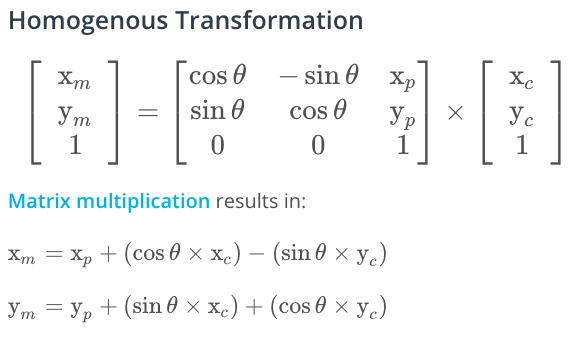

# Overview
This repository contains all the code needed to complete the final project for the Localization course in Udacity's Self-Driving Car Nanodegree.

#### Submission
All you will need to submit is your `src` directory. You should probably do a `git pull` before submitting to verify that your project passes the most up-to-date version of the grading code (there are some parameters in `src/main.cpp` which govern the requirements on accuracy and run time).

## Localization with Particle Filter 

### Particle Filter Overview


### Steps:

1. **Initialization:** we can initialize the estimate location of the object using GPS data, randomly initialize the location of particles and their direction. 

    * a particle contains the following information:

      1. x and y position
      2. orientation (motion direction)

2. **Prediction:** use the motion model and the time of time (∆t) to predict the next location of every particle, and use the observation of each landmark to update the position of the landmarks in the internal map of each particle (particle observation).

    


3. **Update:** Calculate the weight of each particle through comparing the particle's landmark observations and with the landmark's true position. There are a few mini-steps:

    

    1. Transform landmark observations from vehicle's coordinate to map coordinate

        We can use the equation below to do such transformation, usually the rotation angle -90 degrees.

        

    2. Associate each observation with the closest landmark (ground truth)

    3. Update the weight (probability store) of each particle with multivariate Gaussian distribution:

       
    
        * **µx:** landmark's true x-position
        * **µy:** landmark's true y-position
        * **x:** particle's belief of the landmark's x-position (particle's x-position + landmark's observation)
        * **y:** particle's belief of the landmark's y-position (particle's y-position + landmark's observation)


4. **Resample:** We can pick next generations of particles with a probability distribution according to their weight. We can use resampling wheel to do so. (In implementation we can use `std::discrete_distribution` to avoid re-inventing the wheel).


## Pros and Cons


## Project Introduction  

Your robot has been kidnapped and transported to a new location! Luckily it has a map of this location, a (noisy) GPS estimate of its initial location, and lots of (noisy) sensor and control data.  

In this project you will implement a 2-dimensional particle filter in C++. Your particle filter will be given a map and some initial localization information (analogous to what a GPS would provide). At each time step your filter will also get observation and control data.  

  

## Running the Code
This project involves the Term 2 Simulator which can be downloaded [here](https://github.com/udacity/self-driving-car-sim/releases)

This repository includes two files that can be used to set up and install uWebSocketIO for either Linux or Mac systems. For windows you can use either Docker, VMware, or even Windows 10 Bash on Ubuntu to install uWebSocketIO.

Once the install for uWebSocketIO is complete, the main program can be built and ran by doing the following from the project top directory.

1. mkdir build
2. cd build
3. cmake ..
4. make
5. ./particle_filter

Alternatively some scripts have been included to streamline this process, these can be leveraged by executing the following in the top directory of the project:

1. ./clean.sh
2. ./build.sh
3. ./run.sh

Tips for setting up your environment can be found [here](https://classroom.udacity.com/nanodegrees/nd013/parts/40f38239-66b6-46ec-ae68-03afd8a601c8/modules/0949fca6-b379-42af-a919-ee50aa304e6a/lessons/f758c44c-5e40-4e01-93b5-1a82aa4e044f/concepts/23d376c7-0195-4276-bdf0-e02f1f3c665d)

Note that the programs that need to be written to accomplish the project are src/particle_filter.cpp, and particle_filter.h

The program main.cpp has already been filled out, but feel free to modify it.

Here is the main protocol that main.cpp uses for uWebSocketIO in communicating with the simulator.

INPUT: values provided by the simulator to the c++ program

// sense noisy position data from the simulator

["sense_x"]

["sense_y"]

["sense_theta"]

// get the previous velocity and yaw rate to predict the particle's transitioned state

["previous_velocity"]

["previous_yawrate"]

// receive noisy observation data from the simulator, in a respective list of x/y values

["sense_observations_x"]

["sense_observations_y"]


OUTPUT: values provided by the c++ program to the simulator

// best particle values used for calculating the error evaluation

["best_particle_x"]

["best_particle_y"]

["best_particle_theta"]

//Optional message data used for debugging particle's sensing and associations

// for respective (x,y) sensed positions ID label

["best_particle_associations"]

// for respective (x,y) sensed positions

["best_particle_sense_x"] <= list of sensed x positions

["best_particle_sense_y"] <= list of sensed y positions


Your job is to build out the methods in `particle_filter.cpp` until the simulator output says:

```
Success! Your particle filter passed!
```
## Results:

After having run the ./run.sh command, we should be expecting a message: "Listening to port 4567", which signifies that the code has been successfuly copiled and we are good to run the simulator.  

  

After running the simulator successfully, we should be expecting a message: "Success! Your particle filter passed!" on the simulator screen.  

  

# Implementing the Particle Filter
The directory structure of this repository is as follows:

```
root
|   build.sh
|   clean.sh
|   CMakeLists.txt
|   README.md
|   run.sh
|
|___data
|   |   
|   |   map_data.txt
|   
|   
|___src
    |   helper_functions.h
    |   main.cpp
    |   map.h
    |   particle_filter.cpp
    |   particle_filter.h
```

The only file you should modify is `particle_filter.cpp` in the `src` directory. The file contains the scaffolding of a `ParticleFilter` class and some associated methods. Read through the code, the comments, and the header file `particle_filter.h` to get a sense for what this code is expected to do.

If you are interested, take a look at `src/main.cpp` as well. This file contains the code that will actually be running your particle filter and calling the associated methods.

## Inputs to the Particle Filter
You can find the inputs to the particle filter in the `data` directory.

#### The Map*
`map_data.txt` includes the position of landmarks (in meters) on an arbitrary Cartesian coordinate system. Each row has three columns
1. x position
2. y position
3. landmark id

### All other data the simulator provides, such as observations and controls.

> * Map data provided by 3D Mapping Solutions GmbH.

## Success Criteria
If your particle filter passes the current grading code in the simulator (you can make sure you have the current version at any time by doing a `git pull`), then you should pass!

The things the grading code is looking for are:


1. **Accuracy**: your particle filter should localize vehicle position and yaw to within the values specified in the parameters `max_translation_error` and `max_yaw_error` in `src/main.cpp`.

2. **Performance**: your particle filter should complete execution within the time of 100 seconds.
