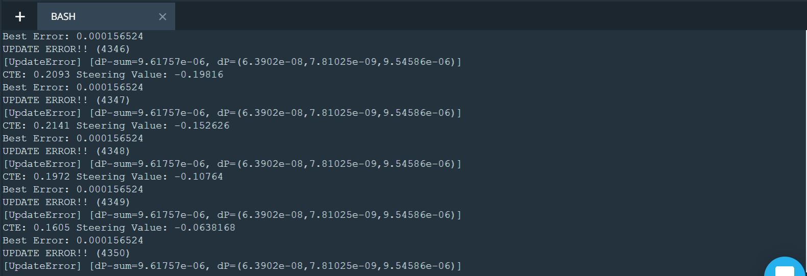
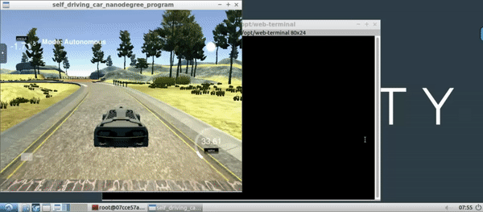

# CarND-Controls-PID
Self-Driving Car Engineer Nanodegree Program

---
## Overview
#### How a PID controller works?

  
                                               Featured Image Credit: Wikipedia  
                                               

The general idea of how PID controller works is actually quite simple. In the following block diagram we can look at r(t) as desired position in traffic lane which comes from our localization and path planning systems. Position (ground truth) in traffic lane is measured using sensor(s) and is represented by y(t) . An error value e(t) would be a difference between r(t) and y(t).
The PID controller is trying to minimize the error rate e(t) over time by applying an adjustment or control variable u(t) (in our case this is steering angle).
Correction value of u(t) is defined with Proportional, Integral and Derivative coefficients.


**The feedback components of PID controller:**  

  

1. Proportional Control: 'P' is the component that is proportional to the current track error. It has direct impact on the trajectory because it makes the car to “correct” in the same proportion of the error in the opposite direction. There’s a natural overshooting effect that will cause the car to swivel hard left and right eventually driving the car off-track. So, larger values of P will cause the car to oscillate faster.
2. Derivative Control — A way to cancel the overshoot effect is to introduce a temporal derivative of the CTE. 'D' is the best estimate of the future trend of the error, based on its current rate of change. When the car has turned enough to reduce the crosstrack error, 'D' will inform the controller that the error has already reduced.
As the error becomes smaller over time the counter steering won’t be as sharp helping the converge the movement to the target trajectory.
3. Integral Control — 'I' considers all past values of the CTE and it’s measured by the integral or the sum of the crosstrack errors over time. The reason we need it is that there’s likely residual error after applying the proportional control. This ends up causing a bias over a long period of time that avoids the car to get in the exact trajectory. This integral term seeks to eliminate this residual error by adding a historic cumulative value of the error.

For more math and control theory based working behind PID controller, please refer this [wikipedia article](https://en.wikipedia.org/wiki/PID_controller).


## Dependencies

* cmake >= 3.5
 * All OSes: [click here for installation instructions](https://cmake.org/install/)
* make >= 4.1(mac, linux), 3.81(Windows)
  * Linux: make is installed by default on most Linux distros
  * Mac: [install Xcode command line tools to get make](https://developer.apple.com/xcode/features/)
  * Windows: [Click here for installation instructions](http://gnuwin32.sourceforge.net/packages/make.htm)
* gcc/g++ >= 5.4
  * Linux: gcc / g++ is installed by default on most Linux distros
  * Mac: same deal as make - [install Xcode command line tools]((https://developer.apple.com/xcode/features/)
  * Windows: recommend using [MinGW](http://www.mingw.org/)
* [uWebSockets](https://github.com/uWebSockets/uWebSockets)
  * Run either `./install-mac.sh` or `./install-ubuntu.sh`.
  * If you install from source, checkout to commit `e94b6e1`, i.e.
    ```
    git clone https://github.com/uWebSockets/uWebSockets 
    cd uWebSockets
    git checkout e94b6e1
    ```
    Some function signatures have changed in v0.14.x. See [this PR](https://github.com/udacity/CarND-MPC-Project/pull/3) for more details.
* Simulator. You can download these from the [project intro page](https://github.com/udacity/self-driving-car-sim/releases) in the classroom.

Fellow students have put together a guide to Windows set-up for the project [here](https://s3-us-west-1.amazonaws.com/udacity-selfdrivingcar/files/Kidnapped_Vehicle_Windows_Setup.pdf) if the environment you have set up for the Sensor Fusion projects does not work for this project. There's also an experimental patch for windows in this [PR](https://github.com/udacity/CarND-PID-Control-Project/pull/3).

## Basic Build Instructions

1. Clone this repo.
2. Make a build directory: `mkdir build && cd build`
3. Compile: `cmake .. && make`
4. Run it: `./pid`. 

Tips for setting up your environment can be found [here](https://classroom.udacity.com/nanodegrees/nd013/parts/40f38239-66b6-46ec-ae68-03afd8a601c8/modules/0949fca6-b379-42af-a919-ee50aa304e6a/lessons/f758c44c-5e40-4e01-93b5-1a82aa4e044f/concepts/23d376c7-0195-4276-bdf0-e02f1f3c665d)

## Implementation

I decided to slightly change the implementation of the PID class and use vector a lot as opposed to single variables or arrays. 
Some of the reasons that motivated this choice are the folloing:
* vector<T> enables random access just like arrays
* vector<T> offers many convenient methods to obtain current size, resize, etc
* vector is part of the C++ standard library

## Choosing the hyperparameters
### Twiddle

The twiddle algorithm, also known as “coordinate ascent” is a generic algorithm that tries to find a good choice of parameters for an algorithm that returns an error. It’s a good strategy for this case and it’s clearly explained by one of [Sebastian Thrun’s course video](https://www.youtube.com/watch?v=2uQ2BSzDvXs).

The variant of my Twiddle algorithm took some time to figure out as I could not use the same Twiddle from the lessons since I did not have the
ability to run a loop in the code, and therefore had to rely on callbacks from another process (i.e. the simulator). Essentially the Twiddle has
2 phases at the most for each component (i.e. P, I, and D):
1. _Phase 0_ where we add a delta to the current component and calculate the steering angle for _N_ callbacks
    * If after N callbacks the error has gone down we increase the delta by 10% (i.e. multiply by 1.1) and move on to to the next component
    * If after N callbacks the error has **not** gone down we move to _Phase 1_ on the same component
2. _Phase 1_ is simular to _Phase 0_ except that we subtract the delta from the current component as opposed to adding it
    * If after N callbacks the error has gone down we increase the delta by 10% (i.e. multiply by 1.1) and move on to to the next component
    * If after N callbacks the error has **not** gone down we decide to reduce the delta for this component by 10% (i.e. multiply by 0.9) and move on to the next component

Twiddle is performed for as long as the sum of deltas for all components is greater than a small epsilon value.

### Speed Control
Besides of implementing a PID controller to define steering values for the car I also did the same for controlling the car speed. To make sure the car doesn't drive towards the edges, I had to stick with an average speed of ~35mph in my simulation. There's definitely room for tuninng the hyperparameters so that the car could try higher speeds than the default 30mph while still keeping its position to the center of the road.

### Parameters P, I, and D

#### Delta Parameters

I initially set the deltas dPp, dPi, and dPd to the same values (0.1) and noticed that the car would quickly go out of bounds. 
I thought it was initially due to the speed and so decided to reduce the throttle from 0.3 to 0.2 but this only delayed the problem. 
I then attempted to think logically about this problem and looked again at the formula from Sebastian Thrun un the lectures:
* The _dPp_ parameter is only affected by the current cte and therefore retains no history of previous CTE. On its own it will make the car oscillate too much from the reference trajectory it should espouse
* The _dPi_ parameter takes into account the sum of previous ctes. **As this sum can grow large it is important to set this coefficient to a smaller value otherwise it will have a disproportionate importance in how we compute the steering angle.** 
* The _dPd_ parameter would capture changes between two consecutive runs and is therefore possibly the most important component, as the difference between the current and previous ctes provides critical information on how to compensate for mainly the _dPp * cte_ part of the formula. **It is therefore the parameter that should be initialised with the highest value**

I decided to apply the following logic:
_dPi_ = _dPd * 0.001_
_dPp_ = _dPd * 0.01_

However, too strong values for _dPd_ cause the car to unecessarily turn too often which affects the speed and general comfort of the ride. Therefore we should make sure to also set it to a reasonable value (e.g. 0.1).

#### Initial PID Values

I decided to start with a _P_ having a larger value than other components, because I thought it would be the most important component at the start since we won't have any deltas nor enough accumulated cross-track error for the other components to have a big enough impact.

The values for the _I_ and _D_ components were found by trying out different values. It turns out setting _D_ to the smallest value at the outset helps obtain the best results.

#### Tuning PID values
To tune a PID use the following steps:
1. Set all gains to zero.
2. Increase the P gain until the response to a disturbance is steady oscillation.
3. Increase the D gain until the the oscillations go away (i.e. it's critically damped).
4. Repeat steps 2 and 3 until increasing the D gain does not stop the oscillations.
5. Set P and D to the last stable values.
6. Increase the I gain until it brings you to the setpoint with the number of oscillations desired (normally zero but a quicker response can be had if you don't mind a couple oscillations of overshoot).

This [thread on stackexchange](https://robotics.stackexchange.com/questions/167/what-are-good-strategies-for-tuning-pid-loops) provides a brief overview of a few general strategies that work well to get a stable system that converges to the right solution.

### Results and Further Observations

The terminal window output includes:
- The deltas dPp, dPi, dPd, and dP-sum
- CTE
- Steering Value



I am not sure but it seems inverting the scale of values between the initial _PID_ and _dPp, dPi dPd_ values produces the best results: e.g. if _D_ has the smallest initial value of the 3 then it should have the largest initial delta value _dPd_.

Throttle was kept at 0.3.

**The following screenshot from the simulation video shows the steering angle right before taking a steep left turn:**

  

I believe I haven't cracked the right approach in handling the steering angle at higher speeds; nevertheless, I did work a way around making sure the steering angle is proportional to the speed.

**The gif below shows a successful run by the car on the track adhering to the P, I, D values:**

  


## Editor Settings

We've purposefully kept editor configuration files out of this repo in order to
keep it as simple and environment agnostic as possible. However, we recommend
using the following settings:

* indent using spaces
* set tab width to 2 spaces (keeps the matrices in source code aligned)

## Code Style

Please (do your best to) stick to [Google's C++ style guide](https://google.github.io/styleguide/cppguide.html).

## Project Instructions and Rubric

Note: regardless of the changes you make, your project must be buildable using
cmake and make!

More information is only accessible by people who are already enrolled in Term 2
of CarND. If you are enrolled, see [the project page](https://classroom.udacity.com/nanodegrees/nd013/parts/40f38239-66b6-46ec-ae68-03afd8a601c8/modules/f1820894-8322-4bb3-81aa-b26b3c6dcbaf/lessons/e8235395-22dd-4b87-88e0-d108c5e5bbf4/concepts/6a4d8d42-6a04-4aa6-b284-1697c0fd6562)
for instructions and the project rubric.

## Hints!

* You don't have to follow this directory structure, but if you do, your work
  will span all of the .cpp files here. Keep an eye out for TODOs.

## Call for IDE Profiles Pull Requests

Help your fellow students!

We decided to create Makefiles with cmake to keep this project as platform
agnostic as possible. Similarly, we omitted IDE profiles in order to we ensure
that students don't feel pressured to use one IDE or another.

However! I'd love to help people get up and running with their IDEs of choice.
If you've created a profile for an IDE that you think other students would
appreciate, we'd love to have you add the requisite profile files and
instructions to ide_profiles/. For example if you wanted to add a VS Code
profile, you'd add:

* /ide_profiles/vscode/.vscode
* /ide_profiles/vscode/README.md

The README should explain what the profile does, how to take advantage of it,
and how to install it.

Frankly, I've never been involved in a project with multiple IDE profiles
before. I believe the best way to handle this would be to keep them out of the
repo root to avoid clutter. My expectation is that most profiles will include
instructions to copy files to a new location to get picked up by the IDE, but
that's just a guess.

One last note here: regardless of the IDE used, every submitted project must
still be compilable with cmake and make./
