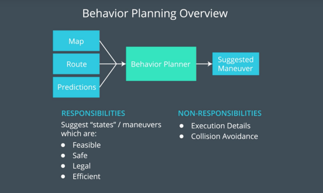
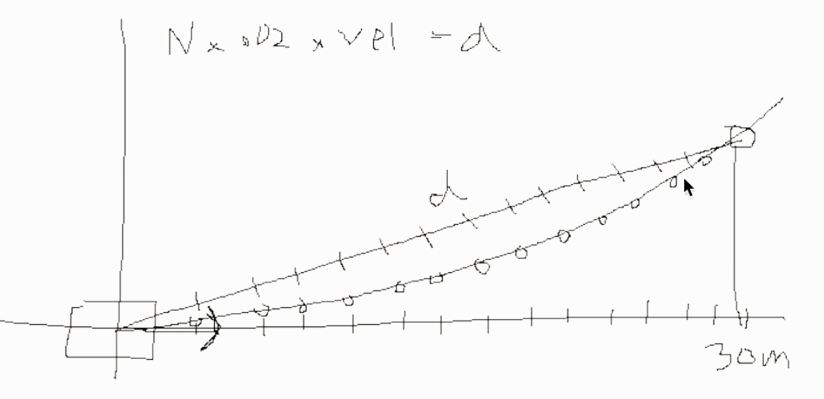
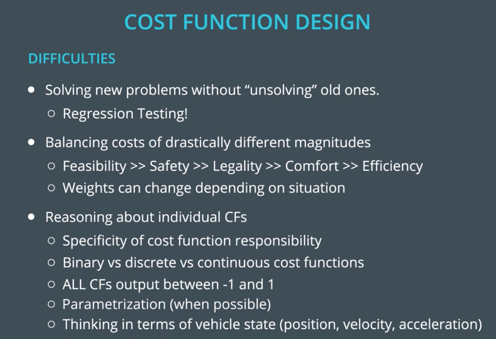

# CarND-Path-Planning-Project
Self-Driving Car Engineer Nanodegree Program

### Overview
'Path Planning' is considered to be the 'cognitive system' (brain) of a self-driving car. This includes how a vehicle might decide where it’s going, both at the macro and micro levels. You will learn about three core components of path planning: environmental prediction, behavioral planning, and trajectory generation.

The constraints of the project are as follows:  
- No collision at any time with other vehicles
- Maximum speed of 50 MPH (~ 80 KMH)
- Maximum acceleration of 10 m/s²
- Maximum jerk of 10 m/s³
- Vehicle cannot be in between lanes for more than 3 seconds
- Vehicle cannot go outside the 3 lanes of the highway
- Vehicle cannot drive on the wrong side of the highway

There are three core components to path planning: 1) Predicting what other vehicles on the road will do next, 2) Deciding on a maneuver to execute, in response to our own goals, and to our predictions about other vehicles, and 3) Building a trajectory to execute the maneuver we decide on.



To make sure whether the chosen path is the best and does not violate any safety or comfort guidelines, follow the brief template:

  

#### Trajectory Generation



The trajectory generation part which is the most difficult is covered as part of the project walk-through by Aaron Brown and David Silver. LINK. They recommend using the open source C++ tk:spline() method to generate a 5th degree polynomial which help minimize jerk while accelerating, decelerating and changing lanes. The summary of operations is as below:
- Take the top two points from the previous trajectory in global X,Y coordinates.
- Project the points ahead in 30m, 60m and 90m spaces from car’s current position. Convert from Fernet (car_s, car_d) to Global XY.
- Convert car’s global XY coordinates to local XY co-ordinates. This helps simplify math a lot.
  

- This gives 5 reference points which can be supplied to tk:spline() function to return a 5th degree polynomial.
- With this polynomial generate new points in local XY co-ordinates. The Y values on the spline can simply be read from corresponding X values on the X-axis as shown.
- Append the points to the previous trajectory after converting back to Global XY co-ordinates.

  

The cost function design penalize the actions based on the guidelines provided:


Here are some of the typical cost functions mentioned in the coursework, that are being used by Udacity's Carla:
  

Finally, Converting the Path to what the Controller Understands:

We can use a lightweight spline library to estimate a cubic polynomial function that passes all the way points as a function of the road distance from the starting point. We can use this convert any position expressed as a number along the the road and sideways of the road. So given our path function we can generate the X,Y coordinates every 0.02 second increments (which the controller expects) over a span of the traversed time. Let’s pass this to our controller
   
### Simulator.
You can download the Term3 Simulator which contains the Path Planning Project from the [releases tab (https://github.com/udacity/self-driving-car-sim/releases/tag/T3_v1.2).  

To run the simulator on Mac/Linux, first make the binary file executable with the following command:
```shell
sudo chmod u+x {simulator_file_name}
```

### Goals
In this project your goal is to safely navigate around a virtual highway with other traffic that is driving +-10 MPH of the 50 MPH speed limit. You will be provided the car's localization and sensor fusion data, there is also a sparse map list of waypoints around the highway. The car should try to go as close as possible to the 50 MPH speed limit, which means passing slower traffic when possible, note that other cars will try to change lanes too. The car should avoid hitting other cars at all cost as well as driving inside of the marked road lanes at all times, unless going from one lane to another. The car should be able to make one complete loop around the 6946m highway. Since the car is trying to go 50 MPH, it should take a little over 5 minutes to complete 1 loop. Also the car should not experience total acceleration over 10 m/s^2 and jerk that is greater than 10 m/s^3.

#### The map of the highway is in data/highway_map.txt
Each waypoint in the list contains  [x,y,s,dx,dy] values. x and y are the waypoint's map coordinate position, the s value is the distance along the road to get to that waypoint in meters, the dx and dy values define the unit normal vector pointing outward of the highway loop.

The highway's waypoints loop around so the frenet s value, distance along the road, goes from 0 to 6945.554.

## Basic Build Instructions

1. Clone this repo.
2. Make a build directory: `mkdir build && cd build`
3. Compile: `cmake .. && make`
4. Run it: `./path_planning`.

Here is the data provided from the Simulator to the C++ Program

#### Main car's localization Data (No Noise)

["x"] The car's x position in map coordinates

["y"] The car's y position in map coordinates

["s"] The car's s position in frenet coordinates

["d"] The car's d position in frenet coordinates

["yaw"] The car's yaw angle in the map

["speed"] The car's speed in MPH

#### Previous path data given to the Planner

//Note: Return the previous list but with processed points removed, can be a nice tool to show how far along
the path has processed since last time. 

["previous_path_x"] The previous list of x points previously given to the simulator

["previous_path_y"] The previous list of y points previously given to the simulator

#### Previous path's end s and d values 

["end_path_s"] The previous list's last point's frenet s value

["end_path_d"] The previous list's last point's frenet d value

#### Sensor Fusion Data, a list of all other car's attributes on the same side of the road. (No Noise)

["sensor_fusion"] A 2d vector of cars and then that car's [car's unique ID, car's x position in map coordinates, car's y position in map coordinates, car's x velocity in m/s, car's y velocity in m/s, car's s position in frenet coordinates, car's d position in frenet coordinates. 

## Details

1. The car uses a perfect controller and will visit every (x,y) point it recieves in the list every .02 seconds. The units for the (x,y) points are in meters and the spacing of the points determines the speed of the car. The vector going from a point to the next point in the list dictates the angle of the car. Acceleration both in the tangential and normal directions is measured along with the jerk, the rate of change of total Acceleration. The (x,y) point paths that the planner recieves should not have a total acceleration that goes over 10 m/s^2, also the jerk should not go over 50 m/s^3. (NOTE: As this is BETA, these requirements might change. Also currently jerk is over a .02 second interval, it would probably be better to average total acceleration over 1 second and measure jerk from that.

2. There will be some latency between the simulator running and the path planner returning a path, with optimized code usually its not very long maybe just 1-3 time steps. During this delay the simulator will continue using points that it was last given, because of this its a good idea to store the last points you have used so you can have a smooth transition. previous_path_x, and previous_path_y can be helpful for this transition since they show the last points given to the simulator controller with the processed points already removed. You would either return a path that extends this previous path or make sure to create a new path that has a smooth transition with this last path.

## Tips

A really helpful resource for doing this project and creating smooth trajectories was using http://kluge.in-chemnitz.de/opensource/spline/, the spline function is in a single hearder file is really easy to use.

---

## Dependencies

* cmake >= 3.5
  * All OSes: [click here for installation instructions](https://cmake.org/install/)
* make >= 4.1
  * Linux: make is installed by default on most Linux distros
  * Mac: [install Xcode command line tools to get make](https://developer.apple.com/xcode/features/)
  * Windows: [Click here for installation instructions](http://gnuwin32.sourceforge.net/packages/make.htm)
* gcc/g++ >= 5.4
  * Linux: gcc / g++ is installed by default on most Linux distros
  * Mac: same deal as make - [install Xcode command line tools](https://developer.apple.com/xcode/features/)
  * Windows: recommend using [MinGW](http://www.mingw.org/)
* [uWebSockets](https://github.com/uWebSockets/uWebSockets)
  * Run either `install-mac.sh` or `install-ubuntu.sh`.
  * If you install from source, checkout to commit `e94b6e1`, i.e.
    ```
    git clone https://github.com/uWebSockets/uWebSockets 
    cd uWebSockets
    git checkout e94b6e1
    ```

## Editor Settings

We've purposefully kept editor configuration files out of this repo in order to
keep it as simple and environment agnostic as possible. However, we recommend
using the following settings:

* indent using spaces
* set tab width to 2 spaces (keeps the matrices in source code aligned)

## Code Style

Please (do your best to) stick to [Google's C++ style guide](https://google.github.io/styleguide/cppguide.html).

## Project Instructions and Rubric

Note: regardless of the changes you make, your project must be buildable using
cmake and make!

## Implementation  
Configuring, Generating, Writing the build files, Scanning dependencies of target path_planning, Linking CXX executable path_planning, Build target path_planning:  
  

The car run on simulator for several laps following the waypoints and meeting all the necessary requirements and regulatory constraints. All the necessary metrics, numbers, can be seen in the images below:  
  


  

Solving the "cognition" part of an autonomous vehicle is one of the toughest challenges to be solved in autonomous vehicles today. Solving the problem of Depth Perception Vision only is only next to Cognition. The path planning, waypoints, and behavior of the car as it uses its cognitive system in decision making while overtaking while still adhering to lane discipline and several constraints as shown below:  

  


  


## Results

Given below is an overview of the final output  

  


Please refer to [video_output.webm](https://github.com/SandeepAswathnarayana/self-driving-car-engineer-nd/blob/master/CarND-Path-Planning-Project/results/video_output.webm) under the "results" folder in the main project repository. All the necessary results can be found under the same folder.  


## Call for IDE Profiles Pull Requests

Help your fellow students!

We decided to create Makefiles with cmake to keep this project as platform
agnostic as possible. Similarly, we omitted IDE profiles in order to ensure
that students don't feel pressured to use one IDE or another.

However! I'd love to help people get up and running with their IDEs of choice.
If you've created a profile for an IDE that you think other students would
appreciate, we'd love to have you add the requisite profile files and
instructions to ide_profiles/. For example if you wanted to add a VS Code
profile, you'd add:

* /ide_profiles/vscode/.vscode
* /ide_profiles/vscode/README.md

The README should explain what the profile does, how to take advantage of it,
and how to install it.

Frankly, I've never been involved in a project with multiple IDE profiles
before. I believe the best way to handle this would be to keep them out of the
repo root to avoid clutter. My expectation is that most profiles will include
instructions to copy files to a new location to get picked up by the IDE, but
that's just a guess.

One last note here: regardless of the IDE used, every submitted project must
still be compilable with cmake and make./
